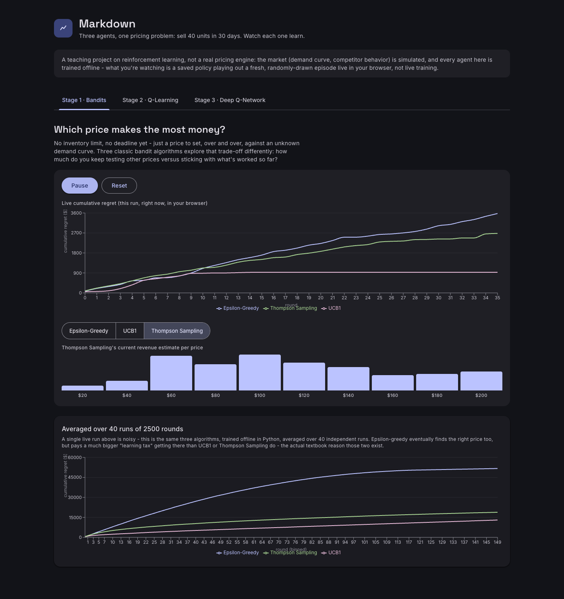
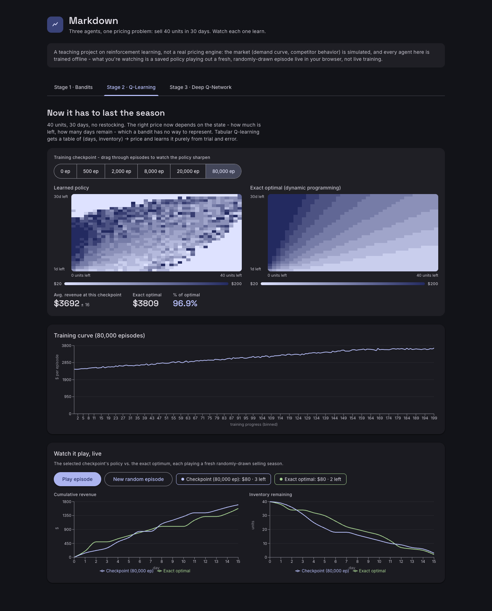
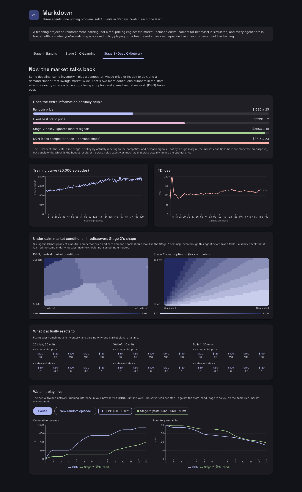

# Markdown

A hands-on introduction to reinforcement learning, built around one real
business problem instead of three unrelated toy demos: **sell 40 units of a
product in a 30-day selling window, at whatever price maximizes revenue.**
This is the actual textbook problem called *revenue management* - it's
literally how airlines price seats and how fashion retailers price
markdowns as a season winds down (hence the name).

Three agents, three algorithms, one market:

1. **Multi-armed bandit** (epsilon-greedy, UCB1, Thompson Sampling) - price
   with infinite restock and no deadline, purely to isolate the
   explore/exploit problem. Stateless on purpose: there's nothing yet to
   remember.
2. **Tabular Q-learning** - the same market, but now there's a real
   deadline and limited stock. State = (days remaining, inventory
   remaining), small enough for a table. This is where the upgrade from
   Stage 1 is actually *necessary*: a bandit has no memory, but the right
   price obviously depends on how much time and stock are left.
3. **Deep Q-Network (DQN)** - add a competitor whose price drifts day to
   day and a market-wide "demand mood" that swings over time. Two more
   continuous state variables, which is exactly where a table stops being
   an option and a small neural net (PyTorch) takes over.

Every agent trains offline in Python; the trained artifacts (a JSON Q-table
policy grid, an ONNX-exported neural network, precomputed training curves)
ship as static files, and the browser does the rest - simulation stepping,
policy lookup, and even the DQN's forward pass all run client-side. There is
no backend at request time.

## Why this is more than a game demo

Reinforcement learning on its own doesn't map to most data-science job
descriptions - but dynamic pricing and inventory/revenue optimization do,
and bandits are the literal algorithm behind a lot of real online
experimentation and personalization systems. This project is built around
that framing on purpose: each stage's algorithmic upgrade is motivated by a
genuine limitation of the last one (no memory -> no way to use extra
context), not bolted on for variety.

## Honesty check: does Q-learning actually reach the right answer?

For Stage 2's small state space, the exact optimal policy is computable via
backward-induction dynamic programming (`backend/dp_solver.py`) -
independent of any learning algorithm. Tabular Q-learning is trained
against that same market and compared directly: after 80,000 episodes it
reaches **~97% of the exact-optimal expected revenue**, and its learned
policy heatmap visibly reproduces the same day/inventory pricing gradient
as the DP solution, just noisier. That comparison ships in the app itself
(Stage 2's two heatmaps side by side), not just asserted in this README.

Stage 3 gets an equivalent honesty check: slicing the DQN's policy at
neutral market conditions (competitor price at its average, no demand
shock) should reproduce Stage 2's policy shape, since at that point the
extra state carries no information. It does. And the DQN's own baseline
comparison is against the Stage-2 policy applied blindly to the richer
environment (i.e. an agent that's good at the deadline/inventory logic but
ignores the competitor and demand signals entirely) - the actual "was the
extra state worth it" question, not just "beats random."

## What's real vs. simplified

- The demand model, dynamic-programming solver, Q-learning updates, and
  DQN training are all real, working implementations - nothing here is
  mocked or hand-tuned to look better than it is. Baseline comparisons,
  regret curves, and the DP-vs-learned policy comparison are actual
  computed results, included with their standard error.
- The market itself is simulated: a Poisson demand model with a
  price-decaying rate, plus (for Stage 3) a random-walk competitor price
  and a mean-reverting demand shock. Realistic in shape, not fit to any
  real retailer's data.
- "Live" playback means a saved policy stepping through a freshly-randomized
  episode in your browser, not live training - training happens once,
  offline (`backend/export_artifacts.py`), and takes about 6 minutes total
  across all three stages.

## Project layout

```
backend/
  env/            demand model + both environments (bandit, revenue-management)
  agents/         bandit algorithms, tabular Q-learning, DQN (PyTorch)
  dp_solver.py    exact backward-induction solution, used as ground truth
  export_artifacts.py   trains everything once, writes frontend/public/data/
frontend/
  src/lib/        JS ports of the environment + bandit algorithms, for live
                  client-side playback (kept numerically checked against
                  the Python versions - see git history for the parity check)
  src/components/ one component per stage, plus shared chart/heatmap/player pieces
```

## Running it

```bash
# Train everything and export artifacts (~6 minutes)
cd backend
python3 -m venv venv && source venv/bin/activate
pip install numpy torch scipy onnx
python export_artifacts.py

# Frontend
cd ../frontend
npm install
npm run dev
```

## Screenshots







## Disclaimer

This is a portfolio/learning project demonstrating reinforcement learning
fundamentals, not a real pricing engine - the market it trades against is
simulated, not fit to real transaction data.
